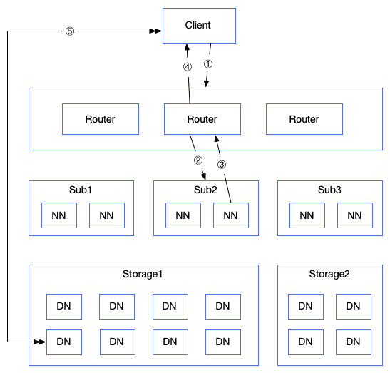
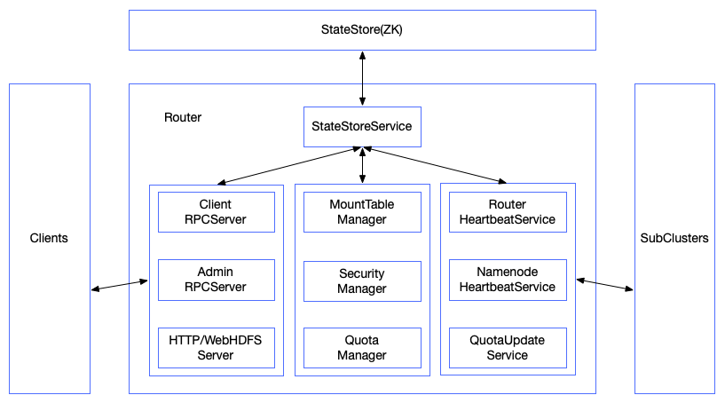
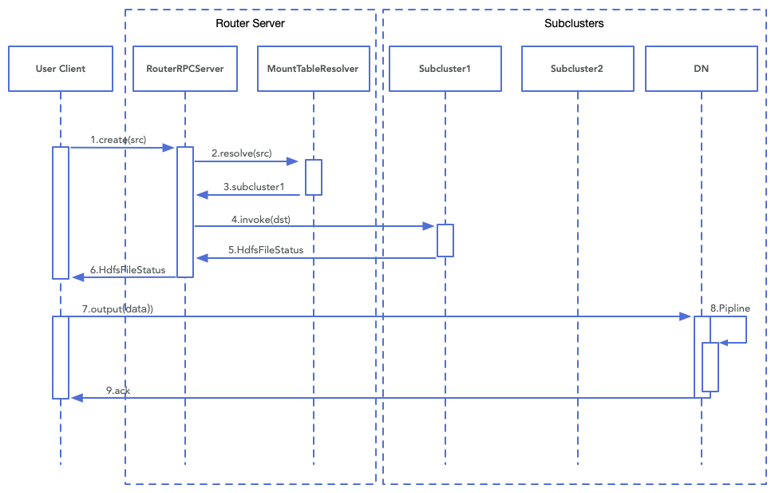
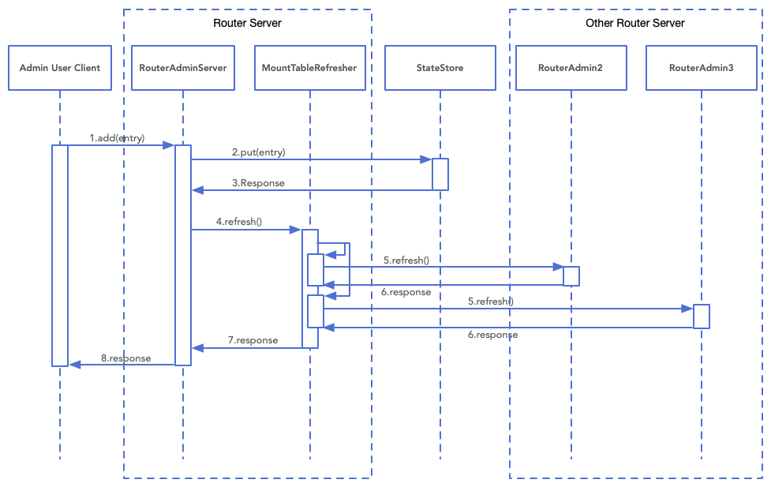
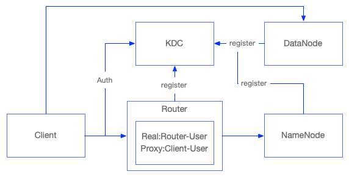
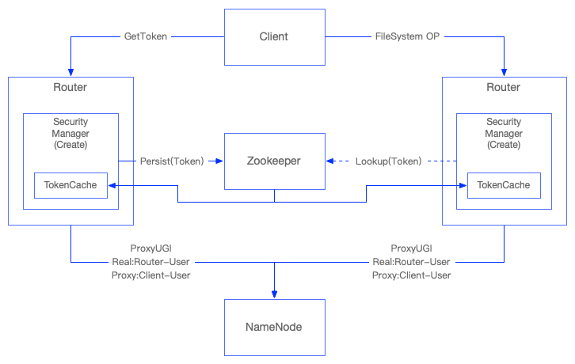
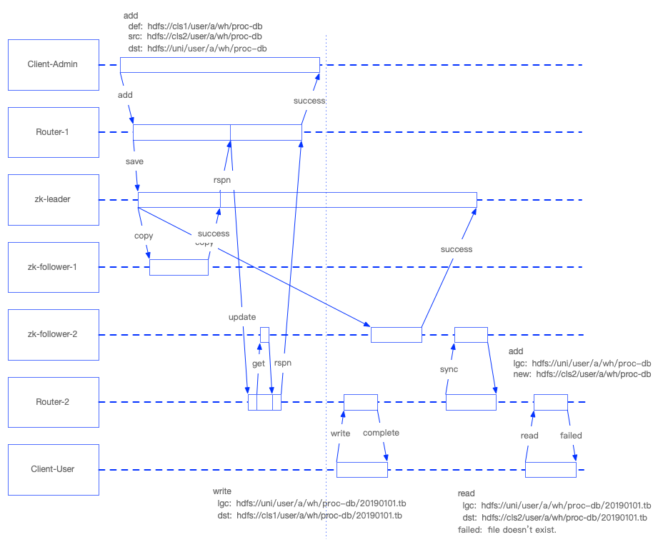
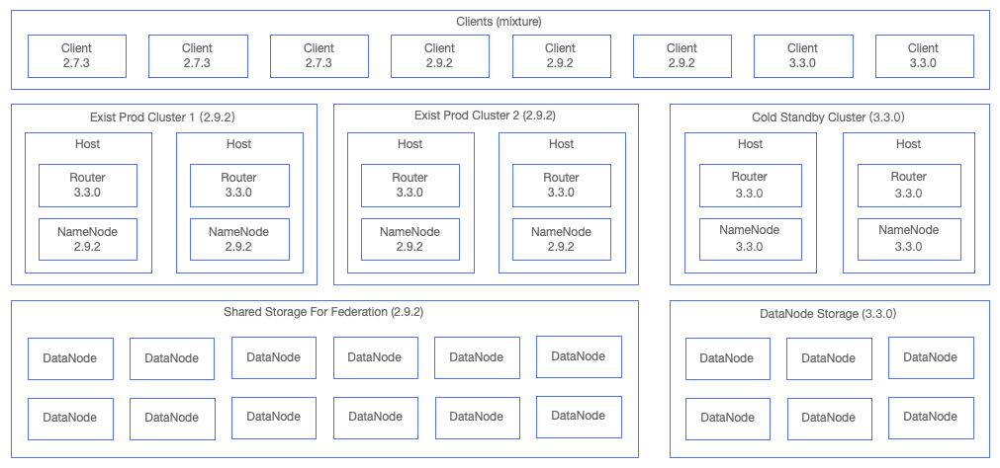

[TOC]


# Router-based HDFS federation

[HDFS-10467 Router-based HDFS federation](https://issues.apache.org/jira/browse/HDFS-10467)

## 一、背景介绍

### 1. 产生背景

众所周知HDFS的可扩展性受限于NameNode，NameNode把所有INode和Block信息全部保存在内存中，并且需要响应所有DataNode心跳及客户端请求。为了解决NameNode的可扩展性问题，通过NameNode Federation特性对元数据进行分区，划分成多个子集群，从而使NameNode可以进行横向扩展。

NameNode Federation解决了HDFS元数据的可扩展性问题，但是用户使用复杂度却提升了；当集群拆分以后，用户需要知道数据在哪个子集群，并通过修改任务配置来指定数据读写位置，当用户任务量多的时候每次拆分集群都会非常麻烦。

HDFS 在早期提供了ViewFS特性，在客户端通过配置项的方式挂载多个子集群，任务使用统一的目录树进行读写数据。但是ViewFS需要客户端自行配置挂载信息，当集群变更时都需要让所有客户端变更挂载信息，同样不利于维护和使用；ViewFS还无法支持多层挂载。

> 多层挂载：
>
> viewfs://ns/user/A 挂载 hdfs://cls1/user/A
>
> 当A用户，有一个新业务合并，需要把另一个大集群挂载到A用户下，类似如下目录树：
>
> viewfs://ns/user/A/bs-2 挂载hdfs://cls2/user/B
>
> viewfs将无法实现类似挂载

为了解决上述的问题，社区提供了Router特性，保证了元数据扩展带来的可维护性增加问题。

### 2. 预期目标

客户端使用原来的HDFS Schema进行统一的目录树访问。

服务端进行目录树的维护，可以进行热挂载，客户端无感知。

服务端接受客户端元数据操作请求，准确转发请求到相应集群，返回操作结果。

服务端为无状态，通过增加节点可轻松实现高可用及可扩展性。

服务端可提供子集群间数据均衡的能力。

### 3. 意义影响

Router的加入具有如下意义及影响：

HDFS元数据从单层结构变成两层结构，客户端对于子集群信息透明化，易用性提升。

NameNode可以更加方便的进行拆分，降低NameNode的负载，从而提升NameNode整体的性能及稳定性。

HDFS的可扩展性得到大幅度提升，单目录树可以从几亿元数据扩展到几十亿甚至上百亿，集群的存储节点数量也可以轻松达到万台；

## 二、架构设计

### 1. 总体架构



Router整体架构如图所示。通过在客户端和NameNode增加无状态的Router层，提供统一目录树，屏蔽底层NameNode的具体分布。Router实现客户端与NameNode的RPC协议，并根据挂载表信息，转发客户端请求到相应的NameNode中，并返回结果给客户端。

客户端的请求流程大致如下：

1. 客户端使用指向Router的统一目录树地址进行文件操作，客户端通过配置的多个Router服务节点随机选择一个节点发送RPC请求。
2. Router服务节点接收到客户端对某个路径的操作请求，通过查找挂载表信息，解析具体操作的子集群，解析成相应子集群路径发起RPC请求。
3. 相应子集群接受到Router发出的文件操作请求，返回相应信息。
4. Router接受到请求处理结果后，返回给客户端。
5. 客户端收到请求结果，根据结果进行相应的DataNode操作。

### 2. 内部服务



上图展示了Router内部包含的服务及模块。

Router需要持久化及共享的数据包括MountTable信息、Token；另外还存储NameNode、Quota、router心跳等缓存信息，重启、迁移均可自动恢复。Router通过StateStore进行持久化及共享数据，目前支持Zookeeper、FileSystem（HDFS、Local）作为StateStore。Local File不建议作为生产环境的StateStore。

Router提供Client/Admin RPC、HTTP/WebHDFS接口。Client RPC实现了客户端与NameNode交互的ClientProtocol接口，进行客户端请求转发；还实现了部分NamenodeProtocol及UserMappingProtocol接口，满足客户端元数据操作需求。WebHDFS服务实现了WebHDFS接口，满足客户端通过RestAPI进行操作；还实现了HTTP服务，提供简单页面、JMX、Configuration等访问。

RouterHeartbeat/SafemodeManager/StateStoreCacheUpdate服务互相配合，周期性检查自身健康状态，并更新到StateStore中。StateStoreCacheUpdate负责周期性从StateStore更新MountTable、NameNode状态和Router状态到Router服务内存中；SafemodeManager则检查Cache更新是否正常，有没有超时，如果出现异常则修改Router状态；RouterHeartbeat负责周期性的更新该Router状态到StateStore中。

NamenodeHeartbeat维护了Router与子集群NameNode的RPC连接，并周期性获取子集群状态信息，（包括：子集群存储消耗，文件数量，剩余容量，健康状态等）并把子集群信息存储到StateStore中。每个Router可以通过配置项来指定需要管理的子集群，可以单个也可以多个，最佳实践是NameNode所在的机器同时部署Router服务，并管理本机NameNode。

Router已经提供了Quota管理的能力，由QuotaUpdate和QuotaManager配合完成。QuotaUpdate负责周期性的为每个挂载点获取最新的Quota信息，并更新到StateStore中；QuotaManager在Router内缓存挂载点的Quota信息，当客户端请求涉及到Quota相应操作时，提供服务。由于Quota是异步同步，会有延迟，但是影响不大。

Router服务中最重要的就是管理MountTable信息。管理员用户可以通过Admin RPC接口进行MountTable的管理；文件系统用户在进行操作时会根据MountTable信息，映射到正确的NameService上。MountTable由两个服务管理：MountTableResolver和MountTableStoreImpl。MountTableStoreImpl提供StateStore进行存取MountTable的接口，对接AdminRPC接口，进行管理；并缓存MountTable记录。MountTableResolver主要为ClientRPC提供Patch解析功能，同样提供缓存。当Router开启AdminRPC接口时，还可以启动MountTableRefresher服务，当AdminRPC接收到MountTable的变更时，Refresher会立即调用其它开启了AdminRPC的Router进行MountTable刷新，从而保证MountTable快速可见（但不具有强一致性或者事务性）。

SecurityManager提供了Token分发及管理的功能，使得Router具备Kerberos认证及Token认证能力，从而兼容安全集群的使用。Router服务通过代理用户模式代理客户端用户进行子集群的访问，Client获取的Token为Router服务生成的Token。Router通过实现ZKDelegationTokenSecretManager进行Token管理，可以持久化Token到Zookeeper，从而达成Token在多个Router之间的共享。

### 3. 功能性设计

#### 3.1 文件系统接口

文件系统接口主要实现ClientProtocol协议，提供文件系统的目录维护、文件读写等功能，后面通过描述写文件的流程来介绍Client、Router和Subcluster如何透明化完成文件系统操作。



图展示了客户端调用create写一个文件时的简化序列图。

1. 客户端使用与原来完全一致的API调用create接口开始一个文件的写入，RPC请求根据客户端的配置按策略发送到其中一个RouterServer。
2. Router端由RouterRPCServer接收客户端请求，内部调用MountTableResolver的接口，解析目标集群和地址。
3. MountTableResolver根据MountTable信息解析客户端要进行操作的目标集群和地址，返回给RPCServer。
4. RouterRPCServer根据解析后的目标集群和地址，使用相应的目标集群接口调用create操作。
5. RouterRPCServer得到目标集群的操作返回信息。
6. RouterRPCServer返回给客户端create操作请求结果。
7. Client根据返回的DN信息，与相应子集群的DataNode建立链接。
8. 建立写Pipeline，进行数据写入。
9. 写ACK返回。

上面暂时的是简化的文件接口操作，在RouterRPCServer处，还包含了一些其它处理，例如：

- Router状态检查，是否处于safemode状态。
- 挂载点的读写权限，Router支持把挂载点设置为只读。
- 统一目录树下的Quota检查。

ClientProtocol协议中的文件操作系统接口大部分和create接口的处理方式类似，例如：addBlock、complete、append、getAdditionalDatanode等。但是也有比较特殊的接口需要特殊的处理，例如：rename。

- rename操作的源地址如果包含挂载点，则抛出AccessControlException。
- rename操作的源地址和目标地址必须属于同个Nameservice，否则抛出IOException。

rename的行为已经和单个Nameservice行为不一样，需要注意。

####3.2 Router服务管理接口

Router服务端在AdminRPC中提供MountTable管理、Nameservice管理、RouterState管理及动态配置更新功能。MountTable管理提供MountTable的增删改查及刷新功能接口。Nameservice管理提供Nameservice的启用、停止和查询接口。RouterState管理提供Router Safemode的进入、离开和查询接口。

Router服务中的AdminRPC服务可以选择启用或者关闭，默认为启用。虽然所有Router都可以启用AdminRPC服务（最佳实践是全部服务都启用），但是dfsrouteradmin客户端只能配置其中的一台Router服务进行调用。

AdminRPC中还包含可选的MountTableRefresher，当MountTable有变更时，可以主动刷新其它Router的MountTable缓存信息。如果没有配置MountTableRefresher，当MountTable有变更时，只是存储到StateStore，其它Router服务会根据StateStore的定期刷新缓存策略，刷新到自身服务的缓存中，有一定的延迟。所以MountTableRefresher可以让MountTable的变更加快生效到其它Router服务的缓存中，但是Zookeeper普通读并非强一致性，会存在脏读情况，需要运维确保MountTable变更生效到所有Router服务。另外还需注意MountTable的变更生效到所有Router服务缓存中的操作并非原子性，在变更时不同客户端可能存在读不一致现象。



该时序图展示了添加MountTable的简化流程：

1. 由具有管理员权限的客户端调用添加MountTable接口，请求发送到客户端配置的RouterAdmin服务。
2. RouterAdmin服务把新增的MountTable信息保存到StateStore中。
3. 返回保存结果。
4. 调用Refresher服务，从StateStore中获取其它Router地址，并为每个Router生成单独线程。
5. 刷新线程调用RouterAdmin的refresh接口，刷新其它Router服务。
6. 返回刷新结果。
7. 其它Router服务全部返回后，再返回给用户；如果其它任意Router刷新失败，只会打印error日志，并无其它额外处理。
8. 返回客户端结果，该结果只表明MountTable是否保存到StateStore，并没有体现所有的Router缓存是否更新成功。

####3.3 安全接口

Router安全方面同样提供Kerberos和Token两个认证方式。Router服务端作为Service注册到Kerberos中，Client经过Kerberos登录后，可以安全的访问到Router服务端。Router服务端通过使用具有HDFS超级代理权限的用户来访问HDFS，并代理客户端用户。

**Router Kerberos**



Router服务端和NameNode/DataNode等其它服务一样，使用Keytab作为Service注册到KDC中。Router可以使用独立的Kerberos用户，也可以使用与NameNode一样的Kerberos用户，要保证的是该用户具有代理其它用户去访问NameNode的权限。当Client调用Router时，Router验证Client Kerberos认证的合法性，并使用自身服务端的用户创建客户端代理用户去访问子集群NameNode。DataNode的数据块操作使用的是BlockToken方式，包含在Block信息中，所以Client到DataNode的访问与原来的方式一样。

**Router Token**



Router服务端同样具备Token认证的能力，从而保证所有原有任务按照Kerberos与Token配合的方式运行。

Router为客户端生成相应的Token，客户端通过该Token进行HDFS访问。当客户端使用Token认证成功以后，Router使用服务端的超级用户代理客户端认证用户，进行子集群访问。Router服务端不会获取子集群NameNode的Token，这相当于在NameNode内存中维护的客户端Token转移到了Router中，从而降低了NameNode的内存消耗及工作负载。

Router服务端默认使用ZKDelegationTokenSecretManagerImpl作为DelegationTokenManager，可以把新建的Token保存到Zookeeper中，从而保证Token在所有Router服务间共享。同时具备Token缓存功能，可以异步缓存Zookeeper中保存的Token。通过Zookeeper共享Token方式从而保证Client只需在某一台Router获取Token，即可在所有Router服务进行认证及接口调用。ZKDelegationTokenSecretManager通过监听Zookeeper的事件变化来更新本地Token缓存，确保在Token变更时能及时更新到本地；watch机制并发一定会成功，所以当客户端发送Token认证请求时，如果本地缓存为找到Token，会到Zookeeper进行查找，不会直接判错。

需要注意的是，如果存在两个HDFS集群属于Kerberos的不同域，并且没有互信，Router将无法支持同时代理这两个子集群，目前只能支持同个Kerberos域或者不同域在Kerberos层互信跨域的情况。这个问题对我们生产环境没有影响，我们具备跨域能力。

### 4. 非功能性设计

#### 4.1 可扩展性

Router最开始就是以无状态服务作为主要设计目标，使得Router服务具有很好的可扩展性，可以根据客户端的请求量部署任意数量的Router服务，确保Router服务不会成为性能瓶颈。客户端可以配置随机选择的方式选择其中的一台Router服务进行调用，并且客户端沿用原来的Failover方式，当使用的Router服务进入安全模式或者出现异常时，自动切换到其它Router服务。

Router所有的元数据均存储在外部StateStore，目前支持Zookeeper和HDFS作为StateStore。主要包括：Router状态信息、MountTable挂载点信息、子集群NameNode信息和DelegationToken信息。除了Token信息会随着用户量的增加而增加以外，其它数据量都非常小，而Zookeeper支持几十万Token的读写并不在话下，Yarn服务已经证明了该方式的可行性。

#### 4.2 性能分析

Router使得客户端对NameNode的请求操作增加了一层RPC调用请求，使得客户端对于元数据的请求响应时间会变长。Router端只是对RPC请求的转发，使得客户端之间不会产生锁竞争，所以RPC请求增加的时间大致为一次网络传输加Router内部处理（目标路径解析等操作）耗时，该耗时增加大致为几毫秒。

NameNode是单点服务，承接集群的所有元数据请求，由于内部锁粒度太粗，使得请求之间锁竞争问题严重，CPU利用率并不高，而客户端对元数据的请求耗时大部分消耗在锁等待上面。当使用Router，对NameNode进行合理分区，将大大减少NameNode的锁竞争，从而使得元数据操作请求响应时间反而降低。

#### 4.3 Zookeeper一致性问题

使用Zookeeper或者HDFS作为Router元数据的StateStore，最大的问题在于这两个组件不保证强一致性，只保证了最终一致性，对Router的影响在于某一节点往StateStore写数据，其它节点读取的时候并不一定能读取到刚刚写入的新数据，存在脏读问题。脏读问题对于MountTable变更有一定的影响，但并不致命。举例说明：



背景：a用户有张数据表proc-db非常大，准备从cls1迁移到cls2集群，统一Namespace为uni，默认关联到cls1，所以变更前MountTable表不存在proc-db的挂载点，准备新增挂载点（/uni/user/a/wh/proc-db --> /cls2/user/a/wh/proc-db），变更前任务从cls1读写文件，变更后从cls2读写文件。

Admin用户发起add MountTable entry命令，Router-1接收请求，并保存到ZK StateStore。ZK只需要大于一半写成功即完成，如图follower-2节点网络延迟很大，leader和follower-1快速写成功，并返回Router-1保存成功（大于半数节点成功），接着Router-1调用Router-2的refresh cache接口，恰巧Router-2连接的是follower-2，cache刷新成功，但是并未同步到新挂载点信息，返回Router-1刷新成功，结束Admin添加挂载点操作。

Client-User在Admin增加完行的挂载点后，往proc-db写数据。Client-User连接到Router-2，但是此时Router-2未更新到新挂载点，依然往cls1里面写数据。当写完该文件后，follower-2完成了数据更新，Router-2完成了缓存更新，Client-User发起读刚写完的数据，此时会发现文件找不到。在生产环境应用时，需要使用合理的管理操作来避免出现类似问题，将在应用设计进行详细介绍。

~~Token的同步同样存在一致性问题，但是由于客户端已经包含了认证失败的重试能力，在该问题上对用户及任务的影响会小很多，认证失败RPC先进行重试，DFSClient层还会进行重试，整个重试过程时间在几十秒，足够覆盖网络延迟导致的一致性问题。~~

## 三、应用设计

Router第一阶段的功能在2.9版本中合入，但是第一阶段只包含了非常基础的功能，存在较多的bug，无法在生产环境使用。第一阶段合入内容：[HDFS-10467 Router-based HDFS federation](https://issues.apache.org/jira/browse/HDFS-10467)。

第二阶段的功能在3.2版本中合入，大部分的辅助功能在这个阶段完成了，但是依然没有包括安全特性，所以依然不适合我们内部应用。第二阶段合入内容：[HDFS-12615 Router-based HDFS federation phase 2](https://issues.apache.org/jira/browse/HDFS-12615)。

稳定性第一阶段在3.3版本中合入，解决了大部分的bug及性能优化，使得Router能达到大规模使用的需求。稳定性第一阶段内容：[HDFS-13891 HDFS RBF stabilization phase I](https://issues.apache.org/jira/browse/HDFS-13891)。

稳定性第二阶段目前大部分还在开发中未合入。稳定性第二阶段内容：[HDFS-14603 Über-JIRA: HDFS RBF stabilization phase II](https://issues.apache.org/jira/browse/HDFS-14603)。

我们内部生产环境强依赖的安全特性在3.3版本中合入，也就是说3.3版本中的Router才适合在生成环境使用。安全特性：[HDFS-13532 RBF: Adding security](https://issues.apache.org/jira/browse/HDFS-13532)。

目前我们生产集群主力是使用2.9.2版本，不会把集群升级到3.3.0版本，而是采用3.3.0版本的Router对接2.9.2版本的HDFS集群的方式来进行应用。在大规模使用之前，我们需要关注两个兼容性问题：

- 2.9.2 HDFS客户端对接3.3.0版本Router
- 3.3.0版本Router对接2.9.2 HDFS集群
- （尽量减少）2.7.3 HDFS客户端对接3.3.0版本Router

基于Router的子集群间数据平衡特性处于开发阶段，预计下个版本合入。[HDFS-13123 RBF: Add a balancer tool to move data across subcluster](https://issues.apache.org/jira/browse/HDFS-13123)。

### 1. 部署架构

根据社区的版本开发情况，后续环境的部署架构大致如下图所示：



目前生产环境存在两种类型集群：2.9.2版本线上生产集群、3.3.0版本线上冷备集群。2.9.2版本集群有联邦集群也有独立集群。Router则采用社区推荐的最佳实践方式，每个NameNode节点部署一个Router服务，Router服务负责本地NameNode健康状态检查，接收所有客户端请求，并访问所有HDFS子集群。

客户端目前存在三种版本：

- Yarn集群中运行的任务使用的HDFS客户端，全部为2.9.2版本。
- 在管理范围内的上层组件使用的客户端，例如：Hive、Azkaban、Mammut服务使用的客户端，目前2.9.2和2.7.3均有。
- 冷备集群客户端为3.3.0版本。
- 用户自己管理的客户端，大部分为2.7.3。

对于集群中存在的2.7.3版本的客户端，当Router上线后，需要对上层服务及组件的请求逐一切换到Router，并依次进行客户端升级，或者进行兼容性评估。以全部客户端升级到2.9.2版本为目标。

#### 1.1 HDFS子集群

子集群关键依赖在于两点：

- 保证所有子集群之间Kerberos跨域可用。
- 子集群间共同路径目录需要梳理，合并或者分区。

> 举例说明共同路径：Yarn日志收集路径为/app-logs，当使用统一目录树以后，多个Yarn集群的日志将指向同个地址，此时的变更策略有两个：
>
> 1. 多个Yarn机器日志统一写到同个子集群中的/app-logs，Yarn集群配置不用变更，依然是/app-logs.
> 2. Router中使用不同路径挂载不同集群的/app-logs，修改Yarn集群配置，指向新路径。
>
> 我的建议是采用第一种方案，日志全部归集到同个集群，并使用日志压缩工具进行压缩。

#### 1.2 Client变更

Router服务的部署并不会对现有客户端造成影响，所以可以在保证上层所有组件不变的情况下，对客户端进行选择性变更，是一个长期的过程，中间保证Router的运行状况确保能承接变更任务。

首先：对Yarn、MR JobHistoryServer和Spark JobHistoryServer进行变更，把日志目录、Staging目录、tmp目录进行统一，并更新Yarn集群计算节点Router的Namespace，确保计算节点可以顺利使用Router。（NM的defaultFS变更是否对任务有影响，需要确认？）

第二步：对Hive、Spark、Azkaban等服务端组件增加Router的Namespace，但是defaultFS不做变更。做完该步骤后，用户可以创建测试目录，并挂载到Router，运行任务显示指定Router Namespace进行子集群访问测试。

第三步：挑选Hive或者Azkaban一个节点，变更defaultFS开始引流（Router默认指向原来的子集群），验证服务稳定性。满足稳定性要求后，逐步切换剩下服务和节点。

第四步：当服务客户端全部变更到Router Namespace后，可以进行业务迁移方案，拆分元数据。

#### 1.3 Router服务端

Router在每个NameNode节点部署一个服务，每个Router服务按照统一模板启用，会启动所有内部子服务。Router服务需要配置所有子集群的Namespace信息，保证能访问所有Namespace。内部子服务的详细配置及说明在后面的运维部署进行详细描述。

#### 1.4 严选集群部署

严选集群目前面临的挑战是单个集群元数据量过大，需要采用Federation拆分集群，但是拆分方案和杭研按照大业务拆分不同。杭研大业务之间数据交互基本没有，而严选按照内部业务进行拆分，内部业务交互很多，需要大量改动任务的配置，所以只能采用Router方案。则严选的变更策略如下：

1. 部署NameNode Federation子集群。
2. 在每个NameNode节点部署Router服务。
3. 对Yarn、JHS服务集群内服务进行defaultFS变更，观察集群稳定性。需要重启NodeManager服务。
4. 对Hive、Azkaban、Mammut等服务端组件增加Router Namespace，验证可用性。
5. 分别对Hive、Azkaban、Mammut单节点进行defaultFS变更，观察服务运行稳定性。
6. 变更所有客户端服务的defaultFS。
7. 迁移业务到新的集群。

### 2. 运维管理

Router的加入屏蔽了底层子集群细节，为客户端提供统一视图，可以保证底层子集群的变更对客户端的影响更小，客户端的易用性得到极大提升，但是在服务端的运维管理并没有得到太大提升，当然随着后续跨子集群Balance工具的开发应用，运维端管理易用性也会大大提升。

#### 2.1 挂载

上面章节分析过Zookeeper的弱一致性对挂载造成的影响，所以需要在运维管理的手段上确保不会造成事故。挂载/卸载目录可以分为如下三种情况：

**全新路径，当前无读写**

对于全新的路径，进行挂载时，只需要确保Router默认的Namespace没有存在即将可进行挂载，挂载后即可进行读写数据。如果默认Namespace已存在路径，需要按照后续两种路径处理。

**只读路径，只有读操作**

当对只读路径进行变更挂载的时候，只要确保数据已经迁移完成，可以进行挂载热变更，对用户的读访问是透明的，不会对用户造成影响。

**读写路径，有读有些**

读写均存在的路径进行挂载变更，是一个用户有感知的操作，此过程为完整迁移过程，在下面章节介绍。

#### 2.2 迁移

**只读路径**

只读路径迁移较为简单，只需要把数据拷贝到目标子集群，变更挂载点即可，对用户是透明的，用户无感知。

**读写路径**

有读写的路径需要迁移时，需要有一定的写限制时间，具体步骤如下：

1. 如果挂载表中不存在待变更路径，那需要先创建指向原来Namespace的挂载点，该操作对用户无感知。
2. 使用Snapshot+discp方案，进行迁移数据操作；追赶到1小时内差距。
3. 在与用户确定的只读时间点，把挂载点设置为只读，此时有写的任务将失败。
4. 迁移最近的增量数据，迁移完成后变更挂载点，变更完成确保所有Router服务生效后，关闭只读，恢复任务。

#### 2.3 扩容

出现以下两种情况，需要进行扩容操作：

- 单集群元数据量过大或者存储量过大无法单集群扩容。
- 单集群热点数据过大，性能无法得到满足。

元数据过大或者热点数据集中，则采用Federation扩容NameNode；如果存储容量不够则部署新集群扩容，或者迁移数据到冷备集群，低成本存储。原则上冷热数据按比例均匀分区，提高整体吞吐量，同时降低单点负载。

#### 2.4 缩容

业务迁移、机房搬迁等会涉及到整个子集群下线，此时需要先进行迁移，再下线子集群。步骤与迁移步骤一致，迁移完成再下线子集群即可。

### 5. 可靠性设计

**监控告警**

Router服务同样具备JMX、审计日志及运行日志数据，可以接入Smilodon。核心监控两项：

- Client端到Router端的RPC请求量及请求响应时间，观察Router的负载均衡及Router内部的处理时间，要与预期相符。Router服务的请求量应该基本相等，内部处理时间应该在毫秒级别，不应该超过10ms。
- Router端与StateStore交互的响应时间，StateStore的响应时间过长，将导致Router之间不一致，是个非常危险的情况。

**审计日志**

Router服务使用超级用户代理客户端用户进行子集群访问，所以子集群的审计日志的记录将全部变成Router用户代理的方式，而客户端的用户情况将由Router的审计日志记录。

**容灾**

Router单节点的故障对客户端毫无影响，客户端具备自动重试机制，可以随机重试到其它节点进行访问。Router服务单节点的重启一样对用户透明，比NameNode节点重启对用户的影响更小，因为其无状态和少量元数据特性。

### 6. 安全性设计

Router需要使用具备跨域的Kerberos。Principle有两种选择：

- 使用hdfs账号，目前hdfs账号具备代理能力。好处：无需重启子集群NameNode；坏处：Router服务的用户也是hdfs，NameNode也是hdfs，不够清晰。
- 新创建router账号，需要重启子集群NameNode，使router账号具备代理能力。好处：账号清晰；坏处：需要重启子集群。

## 四、运维说明

### 1. 部署指南

#### 1.1 Router服务端部署

Router服务端增加了一个新的配置文件：hdfs-rbf-site.xml。

Router服务端需要访问所有子集群的NameNode，首先需要配置包含所有子集群NameService的HDFS Client配置。然后再配置hdfs-rbs-site文件调整Router服务功能。

大部分配置使用默认即可，有变化的配置说明如下：

```xml
<!-- Client RPC -->
  <property>
    <name>dfs.federation.router.rpc-bind-host</name>
    <value>0.0.0.0</value>
    <description>
      把Client RPC绑定到所有ip上。
    </description>
  </property>
  <property>
    <name>dfs.federation.router.rpc-address</name>
    <value>{{hostname}}:8023</value>
    <description>
      指定Client RPC绑定地址，hostname会被dfs.federation.router.rpc-bind-host替换。
    </description>
  </property>

<!-- Admin RPC -->
  <property>
    <name>dfs.federation.router.admin-bind-host</name>
    <value>0.0.0.0</value>
    <description>
      把Admin RPC绑定到所有ip上。
    </description>
  </property>
  <property>
    <name>dfs.federation.router.admin-address</name>
    <value>{{hostname}}:8024</value>
    <description>
      指定Admin RPC绑定地址，hostname会被dfs.federation.router.admin-bind-host替换。
    </description>
  </property>

<!-- HTTP API -->
  <property>
    <name>dfs.federation.router.http-bind-host</name>
    <value>0.0.0.0</value>
    <description>
      把HTTP服务绑定到所有ip上。
    </description>
  </property>
  <property>
    <name>dfs.federation.router.http-address</name>
    <value>{{hostname}}:50071</value>
    <description>
      指定HTTP服务绑定地址，hostname会被dfs.federation.router.http-bind-host替换。
    </description>
  </property>

<!-- HTTPS API -->
  <property>
    <name>dfs.federation.router.https-bind-host</name>
    <value>0.0.0.0</value>
    <description>
      把HTTP服务绑定到所有ip上。
    </description>
  </property>
  <property>
    <name>dfs.federation.router.https-address</name>
    <value>{{hostname}}:50072</value>
    <description>
      指定HTTPS服务绑定地址，hostname会被dfs.federation.router.https-bind-host替换。
    </description>
  </property>

<!-- default Nameservice -->
  <property>
    <name>dfs.federation.router.default.nameserviceId</name>
    <value></value>
    <description>
      设置默认Nameservice，当没有找到匹配的挂载点时，默认使用该子集群下的路径，必须配置
    </description>
  </property>

<!-- Kerberos Config -->
  <property>
    <name>dfs.federation.router.keytab.file</name>
    <value></value>
    <description>
      指定Router使用的keytab地址。
    </description>
  </property>
  <property>
    <name>dfs.federation.router.kerberos.principal</name>
    <value></value>
    <description>
      指定Router RPC使用的Principal名字。
    </description>
  </property>
  <property>
    <name>dfs.federation.router.kerberos.internal.spnego.principal</name>
    <value></value>
    <description>
      指定Router HTTP使用的Principal名字。
      需要注意的是，Router RPC和HTTP使用同个Keytab，意味着两个principal要加到同个keytab中。
    </description>
  </property>

<!-- 负责监控的NameNode对应的Nameservice -->
  <property>
    <name>dfs.nameservice.id</name>
    <value></value>
    <description>
      我们使用每个Router服务监控本地NameNode的方案，需要把该配置设置成当前NameNode对应的Nameservice。
    </description>
  </property>

<!-- MountTable缓存同步更新 -->
  <property>
    <name>dfs.federation.router.mount-table.cache.update</name>
    <value>true</value>
    <description>
      MountTable变更时同步调用其它Router服务，更新MountTable缓存。
      默认为false，我们需要打开这个功能。
    </description>
  </property>

<!-- Quota -->
  <property>
    <name>dfs.federation.router.quota.enable</name>
    <value>false</value>
    <description>
      Router支持Quota功能，默认关闭。
      不建议现在开启该功能，需要再深入测试后打开。
    </description>
  </property>
```

#### 1.2 HDFS Client配置

当HDFS Client端使用Router提供的统一目录树进行数据访问时，需要在hdfs-site增加Router服务对应的Namespace，并修改defaultFS。

```xml
  <property>
    <name>dfs.nameservices</name>
    <value>ns0,ns1,ns2,ns3,{{router-ns}}</value>
  </property>
  <property>
    <name>dfs.ha.namenodes.{{router-ns}}</name>
    <value>r1,r2,r3,r4</value>
  </property>
  <property>
    <name>dfs.namenode.rpc-address.{{router-ns}}.r1</name>
    <value>{{hostname1}}:rpc-port</value>
  </property>
  <property>
    <name>dfs.namenode.rpc-address.{{router-ns}}.r2</name>
    <value>{{hostname2}}:rpc-port</value>
  </property>
  <property>
    <name>dfs.namenode.rpc-address.{{router-ns}}.r3</name>
    <value>{{hostname3}}:rpc-port</value>
  </property>
  <property>
    <name>dfs.namenode.rpc-address.{{router-ns}}.r4</name>
    <value>{{hostname4}}:rpc-port</value>
  </property>
  <property>
    <name>dfs.client.failover.proxy.provider.{{router-ns}}</name>
    <value>org.apache.hadoop.hdfs.server.namenode.ha.ConfiguredFailoverProxyProvider</value>
  </property>
  <property>
    <name>dfs.client.failover.random.order</name>
    <value>true</value>
  </property>
```


#### 1.3 NameNode端变更

如果Router使用独立的principal，则需要在NameNode端配置，使router用户具备代理权限。

NameNode core-site文件增加配置：

```xml
    <property>
      <name>hadoop.proxyuser.{{router-user}}.groups</name>
      <value>*</value>
    </property>

    <property>
      <name>hadoop.proxyuser.{{router-user}}.hosts</name>
      <value>*</value>
    </property>
```


### 2. 运维指南

运维命令目前未发现与官方文档有差别的情况，可以直接参考官方文档。

