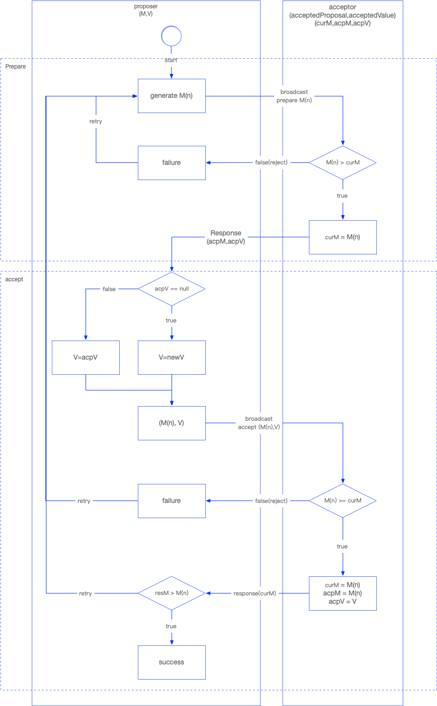
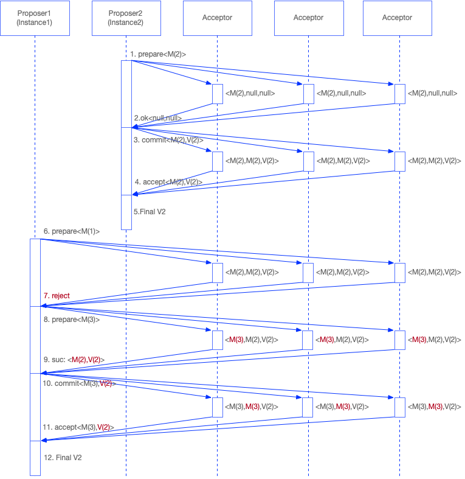
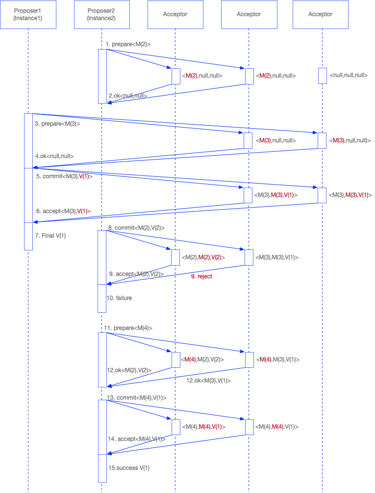
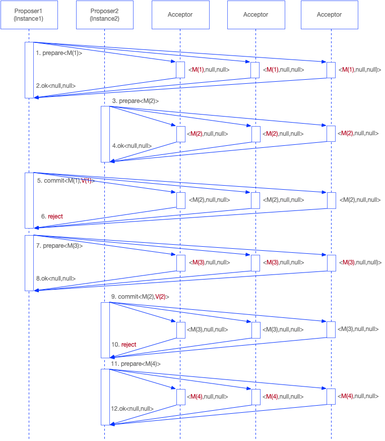

# 分布式一致性算法：Paxos

## 问题和假设

分布式系统中的节点通信存在两种模型：共享内存（Shared memory）和消息传递（Messages passing）。基于消息传递通信模型的分布式系统，不可避免的会发生以下错误：

- 进程可能会慢、被杀死或者重启。
- 消息可能会延迟、丢失、重复。

> 消息也有可能被篡改，但是在基础 Paxos 场景中，不考虑可能出现消息被篡改的情况。

Paxos 算法解决的问题是：在一个可能发生上述异常的分布式系统中如何就某个值达成一致，保证不论发生以上任何异常，都不会破坏决议的一致性。

一个通用的一致性算法可以应用在许多场景中，是分布式计算中的重要问题。一个典型的场景是：在一个分布式系统中，存在某个服务的多个实例，要从中选出一个主服务，并在所有实例间达成一致。

## 算法内容

### 算法包含三种角色

- proposers：负责提出提案，提案信息包括提案编号和提议内容。
- acceptors：负责接受（accept）提案，若提案被多数派（majority）接受，则该提案被批准（chosen）。
- learners：只负责学习被批准的提案（本文不详细说明）。

> 多数派（majority）可以简单理解为：大于一半的acceptors子集。

### 算法简单描述

proposer提出一个提案前，首先要和足以形成多数派的acceptors进行通信，获得他们进行的最近一次接受（accept）的提案（prepare过程），之后根据回收的信息决定这次提案的value，形成提案开始投票。当获得多数acceptors接受（accept）后，提案获得批准（chosen），由acceptor将这个消息告知learner。

### 提案批准流程

#### prepare阶段

proposer选择一个提案编号n并将prepare请求发送给acceptors中的一个多数派；acceptor收到prepare消息后，如果提案的编号大于它已经回复的所有prepare消息（回复消息表示接受accept），则acceptor将自己上次接受的提案回复给proposer，并承诺不再回复小于n的提案；

#### accept阶段

当一个proposer收到了多数acceptors对prepare的回复后，就进入批准阶段。它要向回复prepare请求的acceptors发送accept请求，包括编号n和value（prepare阶段返回的value，如果返回null，那么它可以自由决定value）。在不违背自己向其他proposer的承诺的前提下，acceptor收到accept请求后即批准这个请求。

## 算法详解

上图流程图简单描绘了提案批准的流程。

proposer主要负责发起prepare阶段和发起accept阶段。

acceptor主要负责处理proposer的prepare阶段请求及accept阶段请求。

### proposer处理逻辑

1. 全局单调递增生成提案编号M(n)，发起prepare请求广播到多数派的acceptors。
2. 等待并接收acceptors对于prepare请求的响应结果，响应内容有三种情况：
   - 发送出去的提案编号小于acceptor当前接受的最大编号，被acceptor拒绝，重新递增生成提案编号M(n1)，并继续发送prepare请求。
   - acceptor接受了该提案编号M(n)，返回的结果中未包含任何已经批准的提案，即(acpM,acpV)为空，此时proposer生成新的提案内容Value，发起accept请求广播到多数派acceptors。
   - acceptor接受了该提案编号M(n)，返回的结果中包含任何已经批准的提案，即(acpM,acpV)为已经批准的最新提案编号和提案内容，此时proposer把当前提案编号及返回的提案内容，发起accept请求广播到多数派acceptors。
3. 等待并接收acceptors对于accept请求的响应结果，响应内容有两种情况：
   - acceptor接受proposer发送的提案，响应内容为生效的(acpM,acpV)，至此该proposer结束流程。
   - 提案编号小于当前acceptor可接受提案编号，拒绝proposer发送的提案，proposer重新执行prepare流程，进行重试，直到达成一致。

### acceptor处理逻辑

acceptor内部保存了（当前接受的提案编号，已经批准的提案编号，已经批准的提案内容），并接收proposer的prepare请求及accept请求。

接收到proposer发出的prepare请求时，得到请求的提案编号与当前接受的提案编号对比：

- 如果请求的提案编号大于当前接受的提案编号，则接受该请求，把当前接受的提案变更进行更新，返回已经批准的提案编号及已经批准的提案内容，承诺不再接受小于当前提案编号的提案请求。
- 如果请求的提案编号小于当前接受的提案编号，则拒绝该次提案请求。

接收到proposer发出的accept请求时，得到请求的提案编号与当前接受的提案编号对比：

- 如果请求的提案编号大于当前接受的提案编号，则接受提案，把（当前接受的提案编号，批准的提案编号，批准的提案内容）更新成当前提案编号及提案内容，给proposer返回成功信息。
- 如果请求的提案编号小于当前接受的提案编号，则拒绝该次提案请求。

## 算法用例

假设用例：某个服务有两个实例，通过paxos算法，希望在谁是主服务实例这个问题上达成一致。

### 正常用例

在不考虑网络及节点异常情况下，简略流程如下图所示：

有两个服务实例（Instance1、Instance2），两个proposer分别在没有提案的时候会推选Instance1和Instance2，通过paxos决议选取一个实例作为主服务。

1. 假设proposer2首先发起prepare请求，使用M(2)作为提案编号，广播到多数派acceptor。
2. acceptor初始状态（当前接受的提案编号，已经批准的提案编号，已经批准的提案内容）均为空，可以接受M(2)作为当前提案编号，并响应proposer信息（已经批准的提案编号，已经批准的提案内容），当前为（null, null）。
3. proposer收到多数派响应后，发现当前提案内容为空，生成提案（例如：推选Instance2为主实例，把信息填入value中），并把<M(2),V(2)>作为accept请求阶段内容提交给多数派acceptor。
4. acceptor判断该提案合法，并更新自己的状态内容为：<M(2),M(2),V(2)>，并回复proposer批准提案。
5. proposer收到多数派acceptor返回成功的回复，确定该次提案成功结束，最终值为V(2).
6. proposer1开始发起prepare请求，使用初始提案编号为M(1)，广播到多数派acceptor。
7. acceptor发现该请求的提案编号M(1)小于当前接受的提案编号M(2)，拒绝该次prepare请求。
8. proposer收到多数派的拒绝请求，重新生成新的编号M(3)，并发起prepare请求。
9. acceptor接收该请求，请求编号大于当前提案编号，接受该请求，更新当前提案编号为M(3)；当前已经批准过提案<M(2),V(2)>，所以把该提案回复该prepare请求。
10. proposer收到多数派的接受回复，从回复中取得当前批准过的提案内容V(2)，把V(2)作为提案内容，发起accept请求。
11. acceptor判断该提案合法，并更新自己的状态内容为：<M(3),M(3),V(2)>，并回复proposer批准提案。
12. proposer收到多数派acceptor返回成功的回复，确定该次提案成功结束，最终值为V(2).

以上流程最终结果为：proposer与acceptor最终达成一致，确定Instance2作为主服务实例。

### 异常用例

假如网络或者节点存在异常，流程可能为如下情况：

假设：proposer2无法和acceptor3通信，proposer1无法和acceptor1通信。

1. proposer2首先发起prepare请求，提案编号M(2)，acceptor1和2均成功收到请求，3由于网络问题未收到。
2. 1和2处于初始状态，接受M(2)为当前提案，回复proposer2 OK，proposer2收到多数acceptor返回成功，可以顺利进入第二阶段。
3. 在proposer2进入第二阶段前，proposer1发起prepare请求，提案编号为M(3)，acceptor2和3成功收到请求，1由于网络问题未收到。
4. acceptor2收到的提案编号M(3)大于M(2)，更新当前提案编号为M(3)，回复proposer1 OK；acceptor3处于初始状态，接受提案编号M(3)，回复proposer1 OK。
5. proposer1接收到多数派返回成功，进入第二阶段，由于回复的提案内容为空，所以proposer1提议Instance1为提案内容，发送accept请求，acceptor2和3成功收到请求，1由于网络问题未收到。
6. acceptor2和3收到提案内容，检查提案编号合法，批准该提案，更新状态为<M(3),M(3),V(1)>，回复proposer1.
7. proposer收到2和3的accept回复，提案成功，最终值为V(1)。
8. 此时proposer2进入第二阶段，由于第一阶段收到的提案内容为空，所以proposer2提案内容设置为V(2)，并发送accept请求，acceptor1和2均成功收到请求，3由于网络问题未收到。
9. acceptor1收到提案内容，提案编号合法（proposer1的提案由于网络问题没有到达acceptor1），批准提案，并更新状态<M(2),M(2),V(2)>；acceptor2收到提案内容后，发现收到的请求提案编号为M(3)，允许的提案编号为M(4)，拒绝该次提案。
10. proposer2收到acceptor1回复成功，acceptor2回复拒绝，acceptor3无回复，未过半数，提案失败，从prepare阶段开始重试。
11. proposer2重新发起prepare请求，生成新的提案编号M(4)，acceptor1和2均成功收到请求，3由于网络问题未收到。
12. acceptor1收到提案编号M(4)，接受该提案，返回已经接受的提案<M(2),V(2)>；acceptor2收到提案编号M(4)，大于当前提案编号，接受该提案，返回已经接受的提案<M(3),V(1)>。
13. proposer2收到acceptor1和2的接受提案成功回复，但是返回的已接受提案不一样，acceptor1为<M(2),V(2)>，acceptor2为<M(3),V(1)>，acceptor2的提案编号大于acceptor1的提案编号，所以使用acceptor2返回的提案内容V(1)作为本次accept请求提案内容，并发送accept请求，acceptor1和2均成功收到请求，3由于网络问题未收到。
14. acceptor1收到提案内容，检查提案编号合法，批准该提案，更新状态为<M(4),M(4),V(1)>，回复成功；acceptor2收到提案内容，检查提案编号合法，批准该提案，更新状态为<M(4),M(4),V(1)>，回复成功。
15. proposer2收到1和2的accept回复，提案成功，最终值为V(1)。
16. 最终达成一致。

## 总结分析

Paxos算法是大部分分布式一致性算法的基础，但是该算法存在少量问题，使得它无法直接应用到大规模生产环境中，而基于Paxos衍生出来的ZAB（Zookeeper）、Raft（etcd）等算法解决了Paxos的问题，并大规模应用于生产环境，后续会逐一介绍ZAB和Raft，本节简单介绍一下Paxos的问题。

### 活锁

从第二个用例其实很好看出来，流程大致为：

1. proposer1发起prepare阶段，提案编号M(1)，acceptor通过，准备发起accept阶段。
2. proposer1发起accept阶段之前，proposer2发起prepare阶段，提案编号M(2)，M(2)大于M(1)，acceptor接受该提案编号，后续拒绝小于该提案编号的其它请求。
3. proposer1发起accept阶段，发送提案编号M(1)，提案内容V(1)，acceptor接到请求时，发现提案编号小于当前编号，拒绝proposer1的commit请求，proposer1重新进入prepare阶段，提案编号M(3)，M(3)大于M(2)，acceptor接受该提案编号，后续拒绝小于该提案编号的其它请求。
4. proposer2发起accept阶段，发送提案编号M(2)，提案内容V(2)，acceptor接到请求时，发现提案编号小于当前编号，拒绝proposer2的commit请求，proposer2重新进入prepare阶段，提案编号M(4)，M(4)大于M(3)，acceptor接受该提案编号，后续拒绝小于该提案编号的其它请求。
5. 如此往复循环，成为活锁。

Paxos的作者在后来的论文中也提供了活锁的解决方案，正常有两种方式：

- 通过**随机睡眠-重试**的方法解决。
- 选举主proposer，只有主proposer可以提出提案。

### 性能

从上面的流程可以看出，整个Paxos协议需要端到端大量消息传递，效率较低，后来出现了很多改进算法，优化了Paxos协议的性能，从而达到生产级别。例如：Multi-Paxos、Fast-Paxos、ZAB、Raft等。